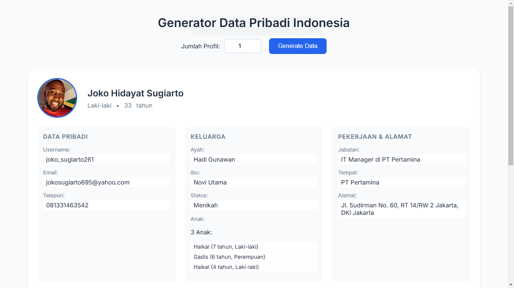
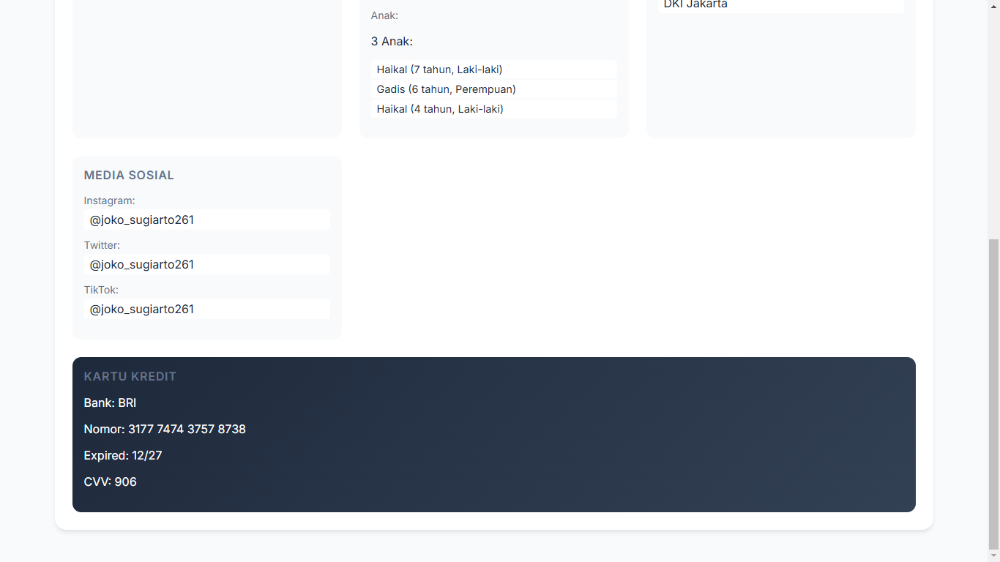

# 🇮🇩 Generator Data Pribadi Indonesia

<div align="center">
  
  
  
  [](https://opensource.org/licenses/MIT)
  
  
</div>

## ✨ Fitur Utama

🔥 **Generasi Data Lengkap**
- Nama lengkap sesuai gender
- Foto profil yang sesuai umur & gender
- Username & email yang unik
- Alamat lengkap & valid
- Data pekerjaan yang realistis
- Kartu kredit (data fiktif)
- Status pernikahan & data keluarga

🎯 **Fitur Spesial**
- Multiple profile generation (1-10 profil)
- Copy dengan double-click
- Loading animation yang smooth
- Responsive design
- Error handling yang baik

## 🖥️ Preview

<div align="center">
  
  
</div>

## 🚀 Penggunaan

1. Generate satu atau lebih profil:
   ```
   Pilih jumlah profil (1-10) → Klik "Generate Data"
   ```

2. Copy data dengan mudah:
   ```
   Double-click pada item yang ingin di-copy
   ```

3. Data yang dihasilkan termasuk:
   - Profil lengkap
   - Informasi keluarga
   - Data pekerjaan
   - Alamat valid
   - Media sosial
   - Kartu kredit (fiktif)

## 🛠️ Teknologi

- HTML5
- CSS3 (Flexbox & Grid)
- Vanilla JavaScript
- [RandomUser.me API](https://randomuser.me)

## 📦 Instalasi

1. Clone repository:
```bash
git clone https://github.com/username/generator-data-pribadi.git
```

2. Buka folder project
```bash
cd generator-data-pribadi
```

3. Jalankan dengan live server atau buka langsung file `index.html` di browser

## Known Issues

- API randomuser.me terkadang lambat
- Beberapa foto profil mungkin tidak 100% sesuai dengan umur
- Loading time bisa lama untuk multiple generations

## Data

Data yang digunakan disimpan dalam format JSON di folder `data/`:
- `names.json` - Kumpulan nama Indonesia
- `locations.json` - Data lokasi dan alamat
- `personal.json` - Data pribadi lainnya
- `additional.json` - Data tambahan
- `jobs.json` - Data pekerjaan dan jabatan

## Lisensi

MIT License - bebas digunakan dan dimodifikasi